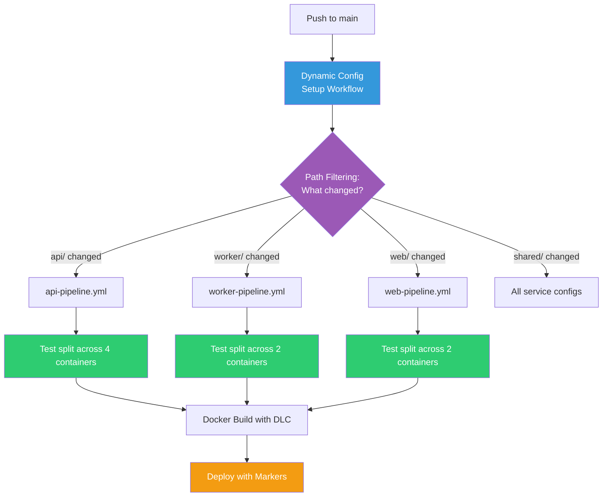

# CircleCI Demo Platform

A multi-service demo application designed to showcase CircleCI platform capabilities including dynamic configuration, test splitting, parallelism, Docker layer caching, and workflow orchestration.

> **Note:** This is a demo/sandbox application for CircleCI feature demonstrations. It is not production code and should not be used as a reference for production architecture.

## Architecture

The platform consists of three services and a shared library:

```
circleci-demo-platform/
├── api/       Flask REST API (backend)
├── worker/    Background task processor (middleware)
├── web/       Flask frontend (UI)
└── shared/    Shared utilities (config, health checks)
```

### API Service

Flask-based REST API providing CRUD operations for items.

| Endpoint          | Method | Description              |
|-------------------|--------|--------------------------|
| `/health`         | GET    | Liveness check           |
| `/items`          | GET    | List all items           |
| `/items`          | POST   | Create a new item        |
| `/items/<id>`     | GET    | Get a single item by ID  |

Items are stored in-memory. Query parameter `?category=` filters the list.

### Worker Service

Background task processor with retry logic and exponential backoff. Processes tasks from an in-memory queue with configurable retry count and delay.

### Web Frontend

Flask app that renders HTML pages and proxies data from the API service. Falls back to mock data when the API is unreachable.

| Route        | Description                          |
|-------------|---------------------------------------|
| `/`          | Home page with service overview      |
| `/health`    | Health check                         |
| `/dashboard` | Dashboard showing items from the API |

### Shared Library

Common utilities consumed by all services:

- **`config.py`** — Environment-based configuration with per-service prefixes
- **`health.py`** — Standardized health check and readiness check responses

## Running Locally

### Individual Services

```bash
# Install dependencies
pip install -r api/requirements.txt

# Run the API
python api/app.py

# Run the worker
python worker/worker.py

# Run the web frontend (set API_URL to point at the API)
API_URL=http://localhost:5000 python web/app.py
```

### With Docker

```bash
# Build and run the API
docker build -t demo-api ./api
docker run -p 5000:5000 demo-api

# Build and run the web frontend
docker build -t demo-web ./web
docker run -p 5002:5002 -e API_URL=http://host.docker.internal:5000 demo-web
```

## Running Tests

Each service has its own test suite using pytest. Run them from the project root:

```bash
# All API tests
python -m pytest api/tests/ -v

# All worker tests
python -m pytest worker/tests/ -v

# All web tests
python -m pytest web/tests/ -v

# Everything
python -m pytest api/tests/ worker/tests/ web/tests/ -v
```

### Test Structure

Each service contains:

- **Unit tests** — Core functionality (health checks, CRUD, retry logic)
- **Validation tests** — Input validation and error handling
- **Flaky tests** — Intentionally intermittent tests that simulate real-world conditions (network timeouts, race conditions, memory pressure). These are useful for demonstrating CircleCI's flaky test detection and rerun capabilities.

### Test Counts

| Service | Tests | Includes Flaky |
|---------|-------|----------------|
| API     | ~19   | 3              |
| Worker  | ~16   | 2              |
| Web     | ~16   | 0              |
| **Total** | **~51** | **5**       |

The test suite is designed to work well with CircleCI's test splitting and parallelism features (target: `parallelism: 4`).

## Configuration

Services are configured via environment variables:

| Variable            | Default              | Description                  |
|---------------------|----------------------|------------------------------|
| `API_HOST`          | `0.0.0.0`           | API bind host                |
| `API_PORT`          | `5000`               | API bind port                |
| `API_DEBUG`         | `false`              | Enable Flask debug mode      |
| `API_URL`           | `http://localhost:5000` | URL the web frontend uses to reach the API |
| `WEB_PORT`          | `5002`               | Web frontend bind port       |
| `WORKER_LOG_LEVEL`  | `INFO`               | Worker log verbosity         |
| `APP_VERSION`       | `0.1.0`              | Application version string   |

## CircleCI Configuration

This project uses **five pipeline definitions** with a single automatic trigger. On every push, the `dynamic-config` pipeline detects which services changed and selects the right config to run. Per-service pipelines remain available for manual API/UI triggers.

### Pipeline Definitions

| Pipeline | Config File | Trigger | Key Features |
|---|---|---|---|
| `dynamic-config` | `.circleci/config.yml` | **All pushes** (only auto trigger) | Setup workflow with [path-filtering](https://circleci.com/developer/orbs/orb/circleci/path-filtering) — selects the right service config |
| `api-pipeline` | `.circleci/api-pipeline.yml` | Manual only | Test splitting (parallelism: 4), DLC, deploy markers via [URL orb](https://github.com/circleci-bcbs/shared-orbs), auto-rerun |
| `worker-pipeline` | `.circleci/worker-pipeline.yml` | Manual only | Test splitting (parallelism: 2), DLC, auto-rerun |
| `web-pipeline` | `.circleci/web-pipeline.yml` | Manual only | Test splitting (parallelism: 2), DLC |
| `scale-demo` | `.circleci/scale-demo.yml` | Manual only | Parallelism: 50 — demonstrates instant compute scaling |

### How It Works



One push triggers **one pipeline** which intelligently routes to the right service config. No wasted compute on unchanged services.

### Features Demonstrated

| Feature | How | Docs |
|---|---|---|
| **Dynamic Config** | `config.yml` setup workflow detects changed dirs, triggers only affected services | [Dynamic Config](https://circleci.com/docs/guides/orchestrate/dynamic-config/) |
| **Test Splitting** | `circleci tests split --split-by=timings` across parallel containers | [Parallelism](https://circleci.com/docs/guides/optimize/parallelism-faster-jobs/) |
| **Flaky Test Detection** | 5 intentionally flaky tests + `max_auto_reruns: 5` generates Insights data | [Flaky Tests](https://circleci.com/docs/guides/insights/flaky-tests/) |
| **Docker Layer Caching** | `setup_remote_docker: docker_layer_caching: true` on build jobs | [DLC](https://circleci.com/docs/guides/optimize/docker-layer-caching/) |
| **Parallelism at Scale** | `scale-demo.yml` runs 50 containers simultaneously | [Resource Classes](https://circleci.com/docs/guides/execution-managed/resource-class-overview/) |
| **Deploy Markers** | Track deployments in the Deploys UI with plan/update/finalize | [Deploy Markers](https://circleci.com/docs/guides/deploy/configure-deploy-markers/) |
| **URL Orbs** | Shared orb from [circleci-bcbs/shared-orbs](https://github.com/circleci-bcbs/shared-orbs) for cross-project reuse | [URL Orbs](https://circleci.com/docs/orbs/author/create-test-and-use-url-orbs/) |
| **Multi-Pipeline** | 5 pipeline definitions in one project, each with its own config | [Pipelines](https://circleci.com/docs/guides/orchestrate/pipelines/) |
| **Auto-Reruns** | Automatic retry on flaky test failure (up to 5 times) | [Auto-Reruns](https://circleci.com/docs/guides/orchestrate/automatic-reruns/) |
| **Test Results** | `store_test_results` feeds Insights with JUnit XML data | [Test Insights](https://circleci.com/docs/guides/insights/test-insights/) |

### Orbs Used

| Orb | Type | Purpose |
|---|---|---|
| [`circleci/python@2.1.1`](https://circleci.com/developer/orbs/orb/circleci/python) | Registry | Python dependency install with caching |
| [`circleci/docker@2.8.2`](https://circleci.com/developer/orbs/orb/circleci/docker) | Registry | Docker build utilities |
| [`circleci/path-filtering@3.0.0`](https://circleci.com/developer/orbs/orb/circleci/path-filtering) | Registry | Monorepo path detection for dynamic config |
| [`bcbsm-platform-tools`](https://github.com/circleci-bcbs/shared-orbs) | URL | Shared deploy markers, notifications, executors |

## License

This project is a demo application and is provided as-is for demonstration purposes.
