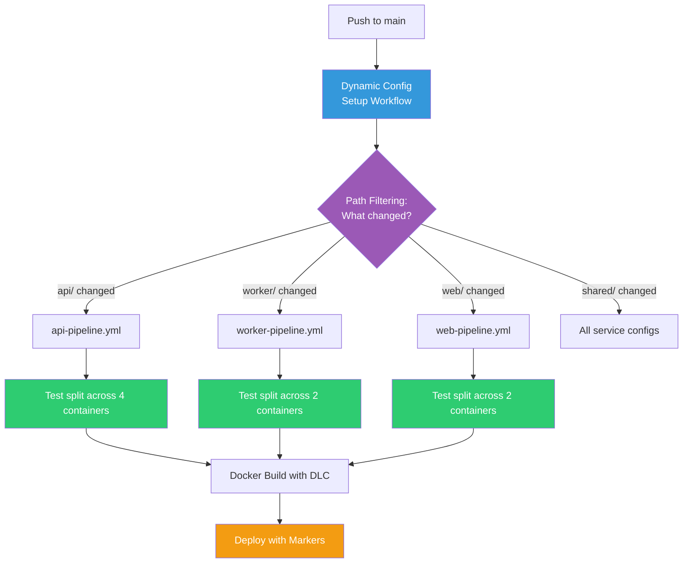

# CircleCI Demo Platform

Multi-service application showcasing CircleCI platform capabilities including dynamic configuration, intelligent test splitting, Docker layer caching, parallelism at scale, flaky test detection, deploy markers, and cross-project config reuse via URL orbs.

**Getting started?** See the [Getting Started Guide](GETTING_STARTED.md) for setup instructions covering project onboarding, pipeline definitions, triggers, and how to demo each feature.

## Architecture

The platform consists of three Python (Flask) services and a shared library:

```
circleci-demo-platform/
├── .circleci/
│   ├── config.yml            # Dynamic config — setup workflow with path-filtering
│   ├── api-pipeline.yml      # API service pipeline
│   ├── worker-pipeline.yml   # Worker service pipeline
│   ├── web-pipeline.yml      # Web service pipeline
│   └── scale-demo.yml        # Parallelism: 50 concurrency demo
├── api/                      # Flask REST API (backend)
├── worker/                   # Background task processor (middleware)
├── web/                      # Flask frontend (UI)
└── shared/                   # Shared utilities (config, health checks)
```

### Services

| Service | Description | Endpoints |
|---|---|---|
| **API** | Flask REST API with items CRUD | `GET /health`, `GET /items`, `POST /items`, `GET /items/<id>` |
| **Worker** | Background task processor with retry logic and exponential backoff | Queue processing with configurable retries |
| **Web** | Flask frontend that proxies data from the API | `GET /`, `GET /health`, `GET /dashboard` |
| **Shared** | Common utilities consumed by all services | `config.py` (env-based config), `health.py` (health checks) |

## CircleCI Configuration

### How It Works

One push triggers **one pipeline** which intelligently routes to the right service config. No wasted compute on unchanged services.



### Pipeline Definitions

| Pipeline | Config File | Trigger | Key Features |
|---|---|---|---|
| `dynamic-config` | `.circleci/config.yml` | **All pushes** (only auto trigger) | Setup workflow with [path-filtering](https://circleci.com/developer/orbs/orb/circleci/path-filtering) — selects the right service config |
| `api-pipeline` | `.circleci/api-pipeline.yml` | Manual only | Test splitting (parallelism: 4), DLC, deploy markers via [URL orb](https://github.com/circleci-bcbs/shared-orbs), auto-rerun |
| `worker-pipeline` | `.circleci/worker-pipeline.yml` | Manual only | Test splitting (parallelism: 2), DLC, auto-rerun |
| `web-pipeline` | `.circleci/web-pipeline.yml` | Manual only | Test splitting (parallelism: 2), DLC |
| `scale-demo` | `.circleci/scale-demo.yml` | Manual only | Parallelism: 50 — demonstrates instant compute scaling |

### Features Demonstrated

| Feature | How | Docs |
|---|---|---|
| **Dynamic Config** | Setup workflow detects changed dirs, routes to the right service config | [Dynamic Config](https://circleci.com/docs/guides/orchestrate/dynamic-config/) |
| **Test Splitting** | `circleci tests split --split-by=timings` across parallel containers | [Parallelism](https://circleci.com/docs/guides/optimize/parallelism-faster-jobs/) |
| **Flaky Test Detection** | 5 intentionally flaky tests + `max_auto_reruns: 5` generates Insights data | [Flaky Tests](https://circleci.com/docs/guides/insights/flaky-tests/) |
| **Docker Layer Caching** | `setup_remote_docker: docker_layer_caching: true` on build jobs | [DLC](https://circleci.com/docs/guides/optimize/docker-layer-caching/) |
| **Parallelism at Scale** | `scale-demo.yml` runs 50 containers simultaneously with zero queue time | [Resource Classes](https://circleci.com/docs/guides/execution-managed/resource-class-overview/) |
| **Deploy Markers** | Track deployments in the Deploys UI with plan/update/finalize | [Deploy Markers](https://circleci.com/docs/guides/deploy/configure-deploy-markers/) |
| **URL Orbs** | Shared orb from [circleci-bcbs/shared-orbs](https://github.com/circleci-bcbs/shared-orbs) for cross-project config reuse | [URL Orbs](https://circleci.com/docs/orbs/author/create-test-and-use-url-orbs/) |
| **Multi-Pipeline** | 5 pipeline definitions in one project, each with its own config | [Pipelines](https://circleci.com/docs/guides/orchestrate/pipelines/) |
| **Auto-Reruns** | Automatic retry on flaky test failure (up to 5 times) | [Auto-Reruns](https://circleci.com/docs/guides/orchestrate/automatic-reruns/) |
| **Test Results** | `store_test_results` feeds Insights with JUnit XML data | [Test Insights](https://circleci.com/docs/guides/insights/test-insights/) |

### Orbs Used

| Orb | Type | Purpose |
|---|---|---|
| [`circleci/python@2.1.1`](https://circleci.com/developer/orbs/orb/circleci/python) | Registry | Python dependency install with caching |
| [`circleci/docker@2.8.2`](https://circleci.com/developer/orbs/orb/circleci/docker) | Registry | Docker build utilities |
| [`circleci/path-filtering@3.0.0`](https://circleci.com/developer/orbs/orb/circleci/path-filtering) | Registry | Monorepo path detection for dynamic config |
| [`bcbsm-platform-tools`](https://github.com/circleci-bcbs/shared-orbs) | URL | Shared deploy markers, notifications, executors |

## Running Locally

```bash
# Install dependencies
pip install -r api/requirements.txt

# Run the API
python api/app.py

# Run the worker
python worker/worker.py

# Run the web frontend
API_URL=http://localhost:5000 python web/app.py
```

### With Docker

```bash
docker build -t demo-api ./api && docker run -p 5000:5000 demo-api
docker build -t demo-web ./web && docker run -p 5002:5002 -e API_URL=http://host.docker.internal:5000 demo-web
```

## Tests

54 tests across 3 services, including 5 intentionally flaky tests for CircleCI Insights detection.

```bash
python -m pytest api/tests/ worker/tests/ web/tests/ -v
```

| Service | Tests | Flaky |
|---|---|---|
| API | 22 | 3 |
| Worker | 16 | 2 |
| Web | 16 | 0 |
| **Total** | **54** | **5** |
