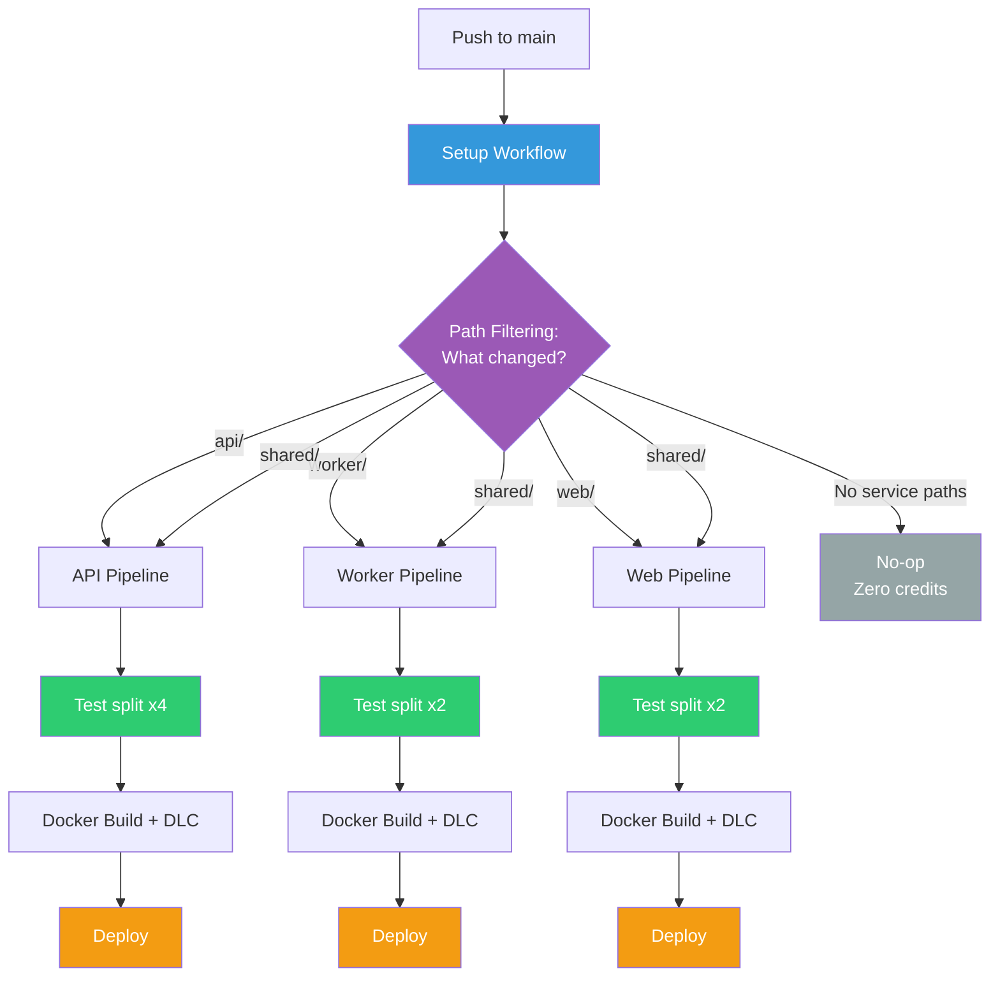

# Platform Services

Multi-service application with a CircleCI pipeline built around monorepo best practices. Dynamic configuration routes builds to only the services that changed, tests are split across parallel containers for fast feedback, and Docker images are built with layer caching for efficient CI.

**Getting started?** See the [Getting Started Guide](GETTING_STARTED.md) for project setup, pipeline configuration, and operational details.

## Architecture

Three Python (Flask) services and a shared library, each independently testable and deployable:

```
platform-services/
├── .circleci/
│   ├── config.yml            # Setup workflow — detects changes, routes to service config
│   ├── api-pipeline.yml      # API build, test, deploy
│   ├── worker-pipeline.yml   # Worker build, test, deploy
│   ├── web-pipeline.yml      # Web build, test, deploy
│   ├── scale-demo.yml        # CI infrastructure load test
│   └── no-updates.yml        # No-op fallback when no service paths change
├── api/                      # REST API (backend)
├── worker/                   # Background task processor
├── web/                      # Frontend
└── shared/                   # Common utilities
```

### Services

| Service | Description | Endpoints |
|---|---|---|
| **API** | Flask REST API with items CRUD | `GET /health`, `GET /items`, `POST /items`, `GET /items/<id>` |
| **Worker** | Task processor with retry logic and exponential backoff | Queue processing with configurable retries |
| **Web** | Frontend that proxies data from the API | `GET /`, `GET /health`, `GET /dashboard` |
| **Shared** | Common config and health check utilities | `config.py`, `health.py` |

## CI/CD Pipeline

### How Builds Work

A single automatic trigger watches for pushes. A setup workflow detects which service directories have changed files and routes to only the affected service pipeline. Unchanged services are skipped entirely.



### Pipeline Definitions

| Pipeline | Config | Trigger | Description |
|---|---|---|---|
| `dynamic-config` | `.circleci/config.yml` | All pushes | Setup workflow with path-filtering — routes to the right service config |
| `api-pipeline` | `.circleci/api-pipeline.yml` | Manual / routed | Test splitting (parallelism: 4), Docker layer caching, deploy markers |
| `worker-pipeline` | `.circleci/worker-pipeline.yml` | Manual / routed | Test splitting (parallelism: 2), Docker layer caching |
| `web-pipeline` | `.circleci/web-pipeline.yml` | Manual / routed | Test splitting (parallelism: 2), Docker layer caching |
| `scale-demo` | `.circleci/scale-demo.yml` | Manual | CI infrastructure load test — 50 parallel containers |
| — | `.circleci/no-updates.yml` | Fallback | No-op job when no service paths match — consumes zero credits |

### Key Engineering Decisions

| Decision | Rationale | Docs |
|---|---|---|
| **Dynamic config with path-filtering** | Avoids building all services on every push. Only changed services run. Changes to `shared/` rebuild all three. | [Dynamic Config](https://circleci.com/docs/guides/orchestrate/dynamic-config/) |
| **No-op fallback** | Non-service changes (docs, config) run a no-op job that consumes zero credits | [No-op Jobs](https://circleci.com/docs/reference/configuration-reference/#job-type) |
| **Test splitting by timing** | 54 tests across the platform — splitting by historical timing balances container load | [Parallelism](https://circleci.com/docs/guides/optimize/parallelism-faster-jobs/) |
| **Docker layer caching** | Multi-stage Python Dockerfiles benefit from layer reuse between builds | [DLC](https://circleci.com/docs/guides/optimize/docker-layer-caching/) |
| **Auto-reruns (max: 5)** | Flaky tests from external dependencies don't block the pipeline permanently | [Auto-Reruns](https://circleci.com/docs/guides/orchestrate/automatic-reruns/) |
| **Deploy markers** | Every deployment tracked in the Deploys UI with status and version | [Deploy Markers](https://circleci.com/docs/guides/deploy/configure-deploy-markers/) |
| **Shared URL orb** | Common deploy marker and notification logic shared across projects via [circleci-bcbs/shared-orbs](https://github.com/circleci-bcbs/shared-orbs) | [URL Orbs](https://circleci.com/docs/orbs/author/create-test-and-use-url-orbs/) |
| **JUnit test results** | `store_test_results` feeds Insights for test analytics and flaky test detection | [Test Insights](https://circleci.com/docs/guides/insights/test-insights/) |
| **Separate pipeline definitions** | Each service has its own config for independent manual triggers and clear separation | [Pipelines](https://circleci.com/docs/guides/orchestrate/pipelines/) |

### Orbs

| Orb | Type | Purpose |
|---|---|---|
| [`circleci/python@2.1.1`](https://circleci.com/developer/orbs/orb/circleci/python) | Registry | Python dependency install with caching |
| [`circleci/docker@2.8.2`](https://circleci.com/developer/orbs/orb/circleci/docker) | Registry | Docker build utilities |
| [`circleci/path-filtering@3.0.0`](https://circleci.com/developer/orbs/orb/circleci/path-filtering) | Registry | Path detection for dynamic config |
| [`bcbsm-platform-tools`](https://github.com/circleci-bcbs/shared-orbs) | URL | Shared deploy markers, notifications, executors |

## Running Locally

```bash
pip install -r api/requirements.txt
python api/app.py                                    # API on :5000
python worker/worker.py                              # Worker
API_URL=http://localhost:5000 python web/app.py      # Web on :5002
```

### With Docker

```bash
docker build -t platform/api ./api && docker run -p 5000:5000 platform/api
docker build -t platform/web ./web && docker run -p 5002:5002 -e API_URL=http://host.docker.internal:5000 platform/web
```

## Tests

54 tests across 3 services. Run from the project root:

```bash
python -m pytest api/tests/ worker/tests/ web/tests/ -v
```

| Service | Tests | Notes |
|---|---|---|
| API | 22 | Includes 3 intermittent tests (network timeout, race condition, connection pool) |
| Worker | 16 | Includes 2 intermittent tests (memory pressure, retry convergence) |
| Web | 16 | Template rendering and route tests |
| **Total** | **54** | |

Intermittent tests simulate real-world conditions and are useful for validating CircleCI's [flaky test detection](https://circleci.com/docs/guides/insights/flaky-tests/) and [automatic rerun](https://circleci.com/docs/guides/orchestrate/automatic-reruns/) capabilities.
